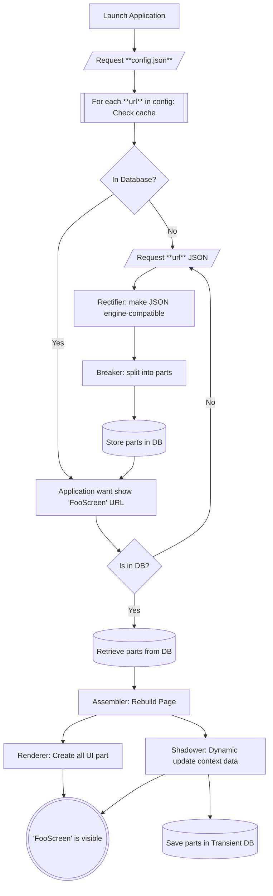

# TUUCHO - ตู้โชว์ - Rendering Engine

!!! warning
    **Documentation in Progress** — Early stage of development — see [Roadmap](roadmap.md).

## Overview

TUUCHO is a dynamic UI rendering engine driven by JSON-based layouts. It interprets a flexible JSON structure describing the entire UI, behaviors and renders the application interface accordingly.

🚀 **It is available on Android and iOS thanks to Kotlin Multiplatform Mobile (KMP).**

### Supported Features

- **Json Content**
    - 100% of the application is driven by the server. Hybrid integration are also possible.
    - Definable components with unique IDs allowing shared references to reduce JSON payload size. This applies to content, styles, text, and more.
    - Intelligent caching: JSON objects are cached locally to minimize repeated network requests. Content is fetched over the network only when necessary.
    - Dynamic context data fetch asynchronously with TTL (Time To Live) capabilities
    - Versioning capabilities self managed [Cache Management](cache.md)

- **Navigation Stack**  
  TUUCHO provides its own navigation stack and supports all capabilities offered by Compose Navigation, including:
    - Clear Stack
    - Single Top
    - Reuse (do not create a new one, bring back an existing one)
    - PopUpTo (inclusive or not)

- **Transition Animations**  
  TUUCHO supports transition animations between screens:
    - Fade
    - Slide Vertically
    - Slide Horizontally

- **Form submission**
    - Local validator and remote controls with user feedback (error or information)
    - Custom command on success or failure

### Supported Components

- **Linear Layout** (vertical or horizontal orientation)
- **Button** with built-in actions:
    - Navigation
    - Form submission
- **Label**
- **Input Field** (form element)
- **Spacer**

---

!!! info
    More to come... For detailed future plans and roadmap, see [Roadmap](roadmap.md).

---

## Json Processing Workflow

1. **Configuration Fetching**  
   The application starts by downloading a JSON configuration file containing a list of URLs and version information.

2. **Content Retrieval**  
   Each URL in the configuration is checked against the local cache. If missing, the corresponding JSON content is fetched from the network.

3. **Rectification**  
   Retrieved JSON data passes through the **Rectifier**, a process that validates and adjusts the JSON structure for compatibility with the rendering engine.

4. **Breaking Down**  
   The rectified JSON is fragmented into smaller components by the **Breaker** process. These components are then stored in the local database.

5. **Home Screen Initialization**  
   When displaying a screen (e.g., `FooScreen`):
   - If components for `FooScreen` exist in the database, they are retrieved.
     - The **Assembler** reconstructs the full JSON page from these components, including only what is necessary.
     - The final JSON is passed to the **Renderer** which draws the UI.
   - If components for `FooScreen` doesn't exist in the database, they are fetched, saved in database. Then the rendering process is done.

6. **Contextual content**
   - If the `FooScreen` contains some contextual data (user context data), it is retrieved in the asynchronously (or synchronously) and the FooScreen is updated on the fly.

---

## Json Parsing Diagram



## Json File Structure

```json
{
  "setting": { /* page setting */ },
  "root": { /* component */ },
  "components": { /* component */ },
  "styles": { /* style */ },
  "options": { /* option */ },
  "contents": { /* content */ },
  "texts": { /* text */ },
  "colors": { /* color */ },
  "dimensions": { /* dimension */ },
  "actions": { /* action */ },
  "states": { /* states */ }
}
```

Each **PAGE** and **TEMPLATE** **must** include a `root` key, which defines the top-level component of the screen. Other keys such as `components`, `contents`, `styles`, `options`, `texts`, `colors`, `dimensions`, `states` and `actions` are optional. Note that the `root` key is **not** required for **SUBS** content.

- **PAGE** represents a full-screen rendered component.
- **TEMPLATE** represents a full-screen rendered component with no content. They can be used multiple times with different contents
- **SUBS** are shared objects that can be referenced by their ID, which always starts with `*`.

Any ID starting with `*` is treated as a reference. When the parser encounters such a reference, it first searches within the current PAGE; if not found, it then looks inside the SUBS.

## More about SUBS

**Subs** are shared libraries loaded by the application before rendering any page (at launch and/or after successful loading).

- They enable sharing of common components, styles, texts, and other assets across multiple pages.
- References to shared objects use the `*` prefix notation.
- Shared components can be either global or local to a page. If the parser does not find a reference locally, it will look for it in the shared library.
- In certain cases, components on a page depend on dynamic data that is not included in the local page definition or cached globally in SUBS. When such components are encountered during the assembly phase, the system handles them intelligently to maintain a smooth user experience.

Many self-explanatory examples are provided throughout this documentation. To make the best use of **Subs**, it is important to understand how to assign IDs to your elements. 

For more details, please refer to the [ID page](object-definition/id.md) or [Subs](config/subs.md) 

### How It Works

When the **Assembler** encounters a component with a reference to an object that is **not locally or globally available**, such as:

```json
{
  "id": {
    "value": "hobbies",
    "source": "*input-field-on-demand"
  },
  "subset": "field"
}
```

it recognizes that additional data is required to fully render the component.

### Background Fetch Process

1. The Shadower gathers all **missing objects** (e.g., components, contents, texts) required to render the page entirely.
2. It initiates a background request to the corresponding dynamic URL: {url-origin}-contextual. This URL is expected to return all the necessary missing elements. You can define custom url also.
3. Once the data is received:
    - The **Shadower** step dynamically injects the new objects into the existing view structure and the transient cache database.
    - The affected UI sections are updated **in place**, without requiring a full reload.

### Placeholder Rendering

While waiting for the missing data, the renderer shows **placeholder UI elements** (aka **skimmers**) in place of the missing content. These serve as visual indicators to users that the data is being loaded.

This ensures:
- Fast initial rendering of all available UI.
- Smooth transition as dynamic data becomes available.
- Flexible modular content delivery that doesn’t block page rendering due to partial data.

In the setting, **you can also make all this process synchronous** and wait all data available before to render.

---


