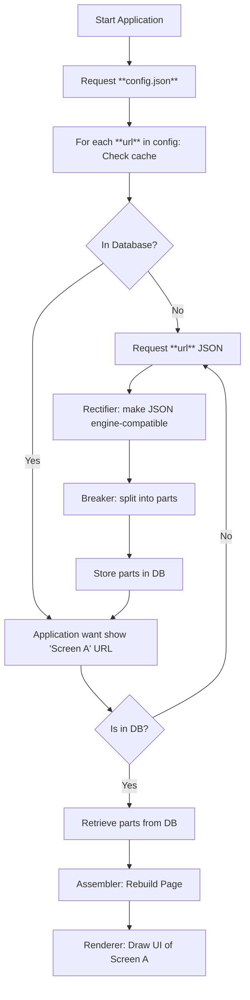

# TUUCHO - ตู้โชว์ - Rendering Engine

# Documentation writing in progress (Just initiated)

## Overview

Application renderer by parsing a JSON that describes the UI layout. A "smart" json is supplied to engine which render the whole application.
Parts can be declare with id as shared object in order to allow to lighte weight Json by just using the id of the object. It works for contents, style, texts and more.
The engine use cache and instead of retrieving again and again the Json, it use cached object. Request on the network are done only if needed.

What is possible now:
  - Linear Layout, Vertical or Horizontal
  - Button
    - navigation action
    - send form action
  - Label
  - Input Field
  - Spacer

You can look at the [Roadmap](roadmap.md) to get more detail where this project is going. Spoil alert, KMM is part on it.

## Process Chart

1. **Configuration Fetching**  
   The application begins by retrieving a JSON configuration file. This file contains a list of URLs and version.

2. **Content Retrieval**  
   Each URL in the configuration is called if not already in cached, and its corresponding JSON content is downloaded.

3. **Rectification**  
   Each retrieved JSON is passed through a **Rectifier** process, which rectify the data make it correct for the renderer engine.

4. **Breaker**  
   The rectified content is then broken into smaller components by the **Breaker** process.  
   Each of these components is recorded in the local database.

5. **Home Screen Initialization**  
   The application wants to show the `screen_a` URL.
    - If the `sreen_a` exists in the database, its components are retrieved.
    - The components are passed through an **Assembler** process to reconstruct json page with only what needed for the screen.
    - The assembled json is passed to the **Renderer** to draw the UI.

## Json Parsing Diagram



## **Page json**

```json
{
  "version": "",
  "root": { **component** },
  "components": [ **component** ],
  "styles": [ **style** ],
  "contents": [ **content** ],
  "texts": [ **text** ],
  "colors": [ **color** ],
  "dimensions": [ **dimension** ]
}
```

Each `PAGE` **must** have at least a `root` key. The `root` defines the top-level component. Other optional keys include: `components`, `contents`, `styles`, `texts`, `colors`, `dimensions`.
`root` is not mandatory inside `SUBS`, .

- `PAGE` are full screen rendered component
- `SUBS` are shared object that can be accessed by reference (id starting by '*')

All `id` starting by "*" are references. When the parser encounter one, it will look first inside the current `page` if the reference exist, then inside the `subs`.

## **Subs**

SUBS are shared library loaded by the application before trying to render a page.

- Used for sharing common components, styles, texts, etc., across multiple pages.
- Reference them using the `*` notation.
- Shared component can be global or local to the page. When the parser do not find the reference locally, it looks for shared library.

---

## Documentation Menu

- [Object Definition](object-definition/index.md)
- [Components Definition](components-definition/index.md)
