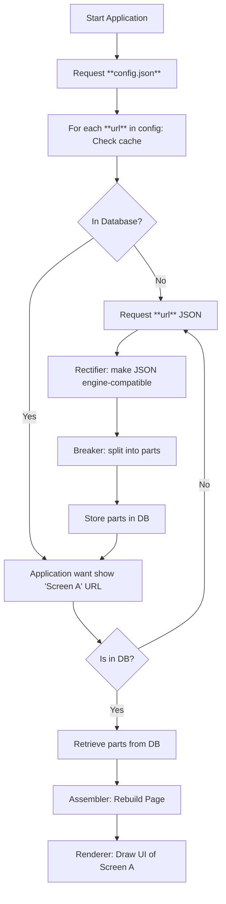

# TUUCHO - ตู้โชว์

> **Documentation in Progress** — Early stage of development


## Overview

TUUCHO is a dynamic UI rendering engine driven by JSON-based layouts. It interprets a "smart" JSON structure describing the entire UI, behaviors and renders the application interface accordingly.

Key features include:

- Definable components with unique IDs allowing shared references to reduce JSON payload size. This applies to content, styles, text, and more.
- Intelligent caching: JSON objects are cached locally to minimize repeated network requests. Content is fetched over the network only when necessary.

### Supported Components

- **Linear Layout** (vertical or horizontal orientation)
- **Button** with built-in actions:
    - Navigation
    - Form submission
- **Label**
- **Input Field** (form element)
- **Spacer**

For detailed future plans and roadmap, see [Roadmap](roadmap.md). Spoiler alert: KMM integration is on the horizon.

---

## Processing Workflow

1. **Configuration Fetching**  
   The application starts by downloading a JSON configuration file containing a list of URLs and version information.

2. **Content Retrieval**  
   Each URL in the configuration is checked against the local cache. If missing, the corresponding JSON content is fetched from the network.

3. **Rectification**  
   Retrieved JSON data passes through the **Rectifier**, a process that validates and adjusts the JSON structure for compatibility with the rendering engine.

4. **Breaking Down**  
   The rectified JSON is fragmented into smaller components by the **Breaker** process. These components are then stored in the local database.

5. **Home Screen Initialization**  
   When displaying a screen (e.g., `screen_a`):
   - If components for `screen_a` exist in the database, they are retrieved.
   - The **Assembler** reconstructs the full JSON page from these components, including only what is necessary.
   - The final JSON is passed to the **Renderer** which draws the UI.

---

## Json Parsing Diagram



## Json File Structure

```json
{
  "version": "",
  "root": { /* component */ },
  "components": [ /* component */ ],
  "styles": [ /* style */ ],
  "contents": [ /* content */ ],
  "texts": [ /* text */ ],
  "colors": [ /* color */ ],
  "dimensions": [ /* dimension */ ]
}
```

Each **PAGE** and **TEMPLATE** **must** include a `root` key, which defines the top-level component of the screen. Other keys such as `components`, `contents`, `styles`, `texts`, `colors`, and `dimensions` are optional. Note that the `root` key is **not** required inside **SUBS**.

- **PAGE** represents a full-screen rendered component.
- **TEMPLATE** represents a full-screen rendered component with not content. They can be used multiple times with different contents
- **SUBS** are shared objects that can be referenced by their ID, which always starts with `*`.

Any ID starting with `*` is treated as a reference. When the parser encounters such a reference, it first searches within the current PAGE; if not found, it then looks inside the SUBS.

## More about SUBS

**Subs** are shared libraries loaded by the application before rendering any page.

- They enable sharing of common components, styles, texts, and other assets across multiple pages.
- References to shared objects use the `*` prefix notation.
- Shared components can be either global or local to a page. If the parser does not find a reference locally, it will look for it in the shared library.

Many self-explanatory examples are provided throughout this documentation. To make the best use of **Subs**, it is important to understand how to assign IDs to your elements. For more details, please refer to the [ID page](object-definition/id.md).

---

## Documentation Menu

- [Object Definition](object-definition/index.md)
- [Components Definition](components-definition/index.md)
- [Subs](subs/index.md)
- [Pages](pages/index.md)
- [Roadmap](roadmap.md)
- [ChangeLog](changelog.md)
