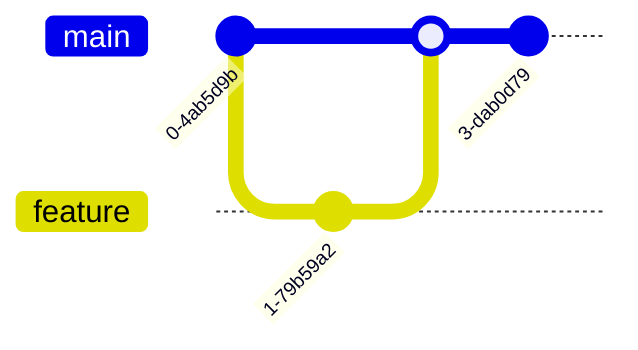

```mermaid
flowchart TD
  %% === Start Phase ===
  A([Start Application]) --> B[Request <b>config.json</b>]
  B --> C[For each <b>url</b> in config → Check cache]
  
  %% === Cache Check ===
  C --> C1{In Database?}
  C1 -- No --> D[Request <b>url</b> JSON]
  C1 -- Yes --> H[App wants to show Screen A]

  %% === Process & Store JSON ===
  D --> E[Rectifier:<br/>Make JSON engine-compatible]
  E --> F[Breaker:<br/>Split into parts]
  F --> G[Store parts in DB]
  G --> H

  %% === Render Phase ===
  H --> H1{Is Screen A in DB?}
  H1 -- Yes --> I[Retrieve parts from DB]
  H1 -- No --> D
  I --> J[Assembler:<br/>Rebuild Page]
  J --> K[Renderer:<br/>Draw UI of Screen A]

  %% === Grouping for Clarity ===
  subgraph Network ["💻 Network Requests"]
    D --> E --> F
  end

  subgraph Storage ["🗄️ Local Database"]
    G
    I
  end

  subgraph UI ["🖥️ UI Rendering"]
    J --> K
  end
```

```mermaid
erDiagram
  CUSTOMER ||--o{ ORDER : places
  CUSTOMER {
    id PK
    name
  }
  ORDER {
    id PK
    customer_id FK
    total
  }
```





```mermaid
C4Context
  Person(user, "User")
  System(system, "Web App")
  user --> system : "Uses"
```





